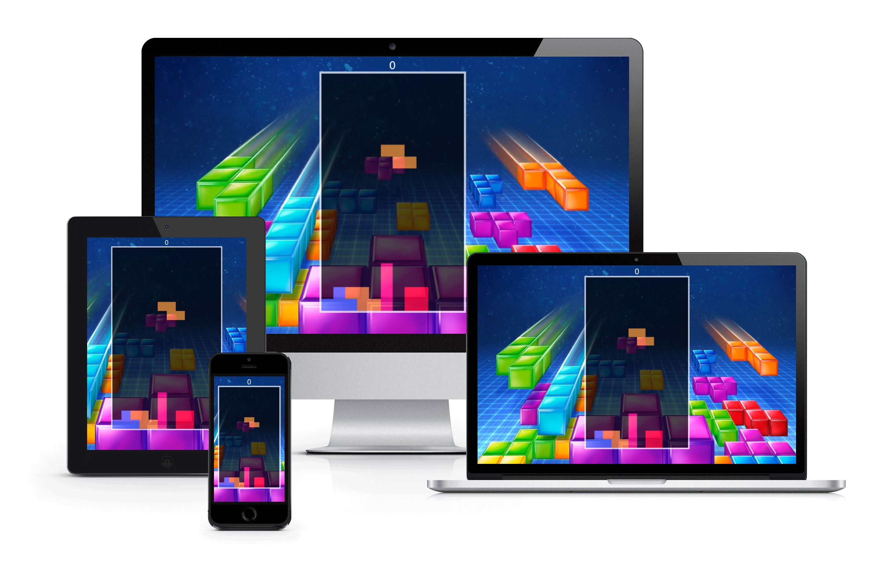

# TetrisJS
Web application is clone legendary old school bricks game. Originally was game developed by russian programmer in 1984, actually
game is extended around all the world. You can play the game on different devices from personal computer to smartphones with
access on the internet. Diversity support responsive design used in game, it capable adapt on any screen size.

## Rules
Game is compose with four bricks falling from top screen. The main goal player is sort bricks into wall on bottom game area.
If you complete fill row, the row disappear. Player must delete rows as long possible, because when brick touches top corner, 
the game ends. Player can delete max four rows at one time by shape "I". This action is called tetris.

## Technologies
* HTML
* CSS
* Javascript

## Access
If you like play the tetris game, click on this [link](http://jiricaga.cz/tetris)
